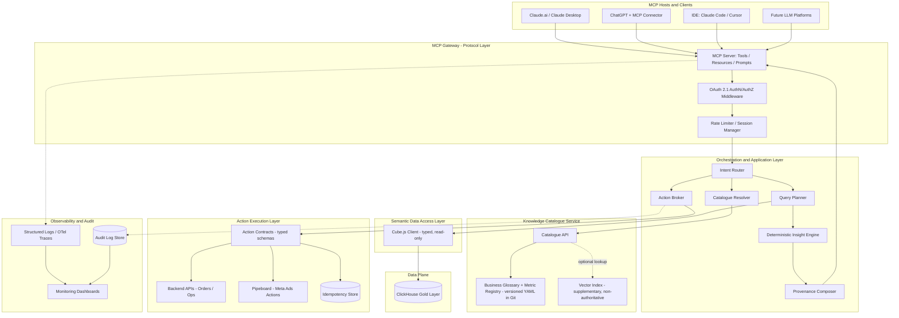
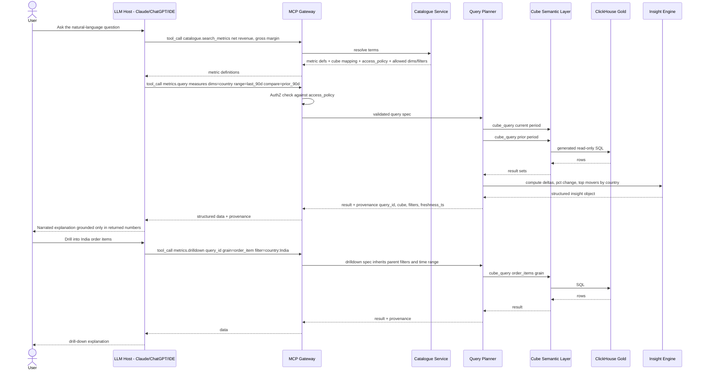
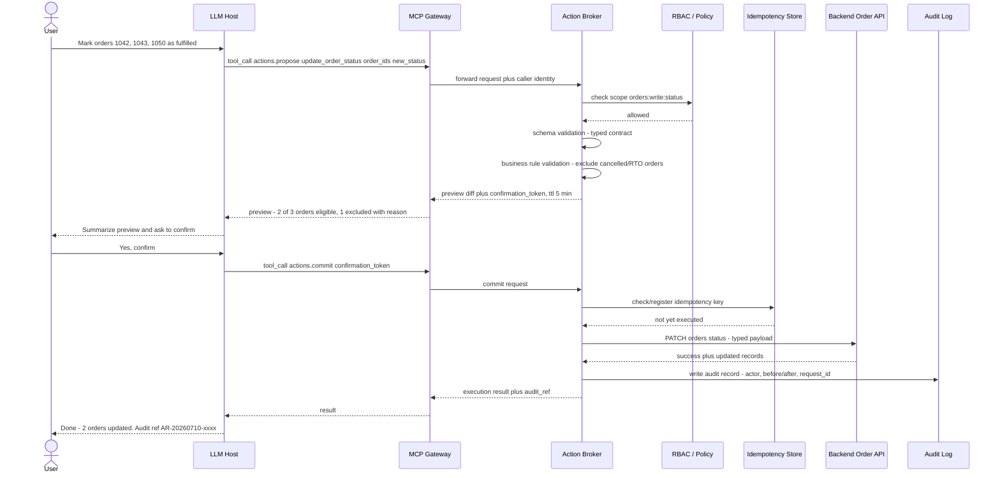

# Model-Agnostic MCP Agent — MVP Architecture
### Data retrieval, insight generation, and safe action execution over Cube + ClickHouse + Pipeboard

---

## 0. Framing

This design treats the MCP server as a **thin, deterministic gateway** in front of your existing Seleric stack (Cube semantic layer on the ClickHouse gold layer) plus your action executors (Pipeboard for Meta Ads, backend APIs for operational domains like orders). The LLM — whether it's Claude, ChatGPT, or an IDE agent — never touches ClickHouse, never invents a formula, and never executes a write without a typed, previewed, confirmed contract. Everything numeric that reaches the model comes from Cube; everything the model narrates is grounded in a structured result object with provenance attached.

The two reference articles you shared describe the standard three-layer MCP mental model (Model/Brain → Protocol/Nervous System → Runtime/Muscles) and the client-server-hybrid placement patterns for multi-agent MCP systems. This design follows that model but keeps the "brain" placement strictly on the client side (Claude/ChatGPT/IDE host) for the MVP — the MCP server itself stays LLM-free, which is what makes it genuinely model-agnostic and reusable later inside a multi-agent system.

---

## 1. MVP Scope and Assumptions

**In scope for MVP:**
- Read-only data retrieval and metric/insight generation over the existing gold-layer Cube semantic model.
- One knowledge catalogue (business glossary + metric/dimension registry) as the single source of truth for what the agent is allowed to say and query.
- Safe execution of a small number of pre-approved actions (one Meta Ads action via Pipeboard, one operational action via a backend API), using a propose → confirm → commit contract.
- A single MCP server, reachable by Claude.ai/Desktop, ChatGPT (via connector), and IDEs (Claude Code, Cursor), with no client-specific logic.
- No multi-agent orchestration — one reasoning agent (the host LLM), one MCP server, one catalogue.

**Explicitly deferred (not MVP):**
- Multi-agent routing/orchestration layer, agent-to-agent protocols, specialized sub-agents per domain.
- Vector/semantic search as a primary retrieval path (kept supplementary only, and possibly skipped entirely at MVP catalogue size).
- Write actions beyond the two reference flows.
- Fine-grained row-level multi-tenant security (assumed single org for MVP).
- SLA-grade real-time freshness; assumed batch/daily-refreshed gold layer is acceptable for now.

**Assumptions made (flagged as open decisions in §16 where they need sign-off):**
1. The gold-layer Cube semantic model (`canonical_pnl`, `commerce_orders`, `meta_ad_performance`, `customer_ltv`, `payment_cashflow`, `meta_ad_breakdown`, `google_ad_performance`, `session_funnel`, etc.) is stable enough to be catalogued now; the migration's deprecation table becomes the catalogue's `deprecated_aliases`.
2. **Pipeboard** is the action executor specifically for **Meta Ads** operations (pause/resume ads, adjust budgets, create campaigns) — it is not a general-purpose action layer. Any non-ads action (e.g., updating order status) needs a **separate backend API**, which this design assumes exists or will be built as a typed service. Both are unified behind one internal Action Contract abstraction so the LLM-facing interface doesn't care which system executes underneath.
3. Org identity is available via an existing SSO/IdP (Okta / Google Workspace / Azure AD) — needed for OAuth2.1 at the MCP gateway.
4. Query volume is BI-conversational (bursty, low-to-moderate concurrency), not a high-throughput OLTP pattern — Cube's pre-aggregations are assumed sufficient without new infra.
5. Freshness cadence per gold table is not fully known to me — I've modeled a generic `freshness` field per catalogue entry that must be filled in per table by data engineering.

---

## 2. Recommended High-Level Architecture

Seven layers, each independently testable and independently replaceable:

1. **MCP Gateway** (protocol layer) — the only thing any LLM client talks to. Implements the MCP spec (tools/resources/prompts) over stdio (IDEs) and Streamable HTTP/SSE (remote clients), with OAuth2.1.
2. **Orchestration / Application Layer** — intent routing, catalogue resolution, query planning, deterministic insight computation, action brokering, provenance assembly. This layer contains zero LLM calls — it's plain application code.
3. **Knowledge Catalogue Service** — the authoritative registry of metrics, dimensions, glossary terms, formulas, filters, ownership, access policy, and freshness. Structured metadata is authoritative; a vector index is optional and supplementary only.
4. **Semantic Data Access Layer** — a typed, read-only client over Cube's API. This is the *only* path to data. No raw SQL ever reaches the LLM or is generated by it.
5. **Data Plane** — ClickHouse gold layer, accessed exclusively through Cube, with a read-only service credential.
6. **Action Execution Layer** — typed action contracts, a broker that validates/previews/confirms/commits, and the two downstream executors (Pipeboard for Meta Ads, backend REST APIs for everything else).
7. **Observability & Audit** — structured logs, traces, an immutable audit store, and dashboards, feeding provenance back into every response.

---

## 3. HLD Component Diagram



---

## 4. LLD — Component by Component

### 4.1 MCP Gateway
- **Responsibility:** single protocol surface; registers all tools/resources/prompts; terminates OAuth2.1; enforces per-session rate limits; never contains business logic.
- **Interfaces:** Streamable HTTP/SSE for remote hosts (Claude.ai, ChatGPT), stdio for local IDE agents (Claude Code, Cursor) via a thin local bridge that forwards to the same remote server.
- **Key design point:** identical tool schemas regardless of transport — this is what makes it model-agnostic. No "if client == ChatGPT" branches.
- **Tech:** official MCP SDK (Python `FastMCP` or TypeScript `McpServer`) — see §14.

### 4.2 Orchestration / Application Layer
- **Intent Router:** cheap, deterministic classification of the tool call into `catalogue-lookup`, `metric-query`, `insight`, `action-propose`, `action-commit` — mostly just dispatch, since the LLM has already chosen a tool; this layer's real job is validating that the chosen tool call is well-formed before anything touches data or systems of record.
- **Catalogue Resolver:** turns business language ("net revenue", "topline", "MER") into canonical metric/dimension IDs using the glossary; rejects unknown terms rather than guessing.
- **Query Planner:** builds one or more Cube.js query JSON objects (current period, comparison period, drill-down grain) from a validated metric/dimension/filter set; owns pagination and row-limit enforcement.
- **Deterministic Insight Engine:** pure code (no LLM) that computes deltas, % change, contribution/top-mover ranking, and simple anomaly flags from Cube results.
- **Action Broker:** validates, previews, and commits actions (detailed in §4.5).
- **Provenance Composer:** attaches `{metric_ids, cube, filters_applied, time_range, comparison_period, freshness_ts, catalogue_version, query_id}` to every data response.

### 4.3 Knowledge Catalogue Service
- **Storage:** versioned YAML files in git (`catalogue/metrics/*.yaml`, `catalogue/dimensions/*.yaml`, `catalogue/glossary/*.yaml`, `catalogue/actions/*.yaml`), loaded into memory/Postgres at deploy, with a catalogue schema version stamped on every response.
- **API:** `get_metric(id)`, `search(query)`, `list_dimensions(cube)`, `resolve_term(text)`, `freshness(cube)`.
- **Search:** keyword/BM25 first; an embeddings index is optional and only ever used to *suggest* candidate matches for a human or LLM to confirm — it never resolves a term authoritatively on its own. At your current likely catalogue size (tens of metrics from `Seleric_Query_Reference_v2.md`), plain keyword match on glossary synonyms will probably cover most queries without needing embeddings at all.
- **Governance:** every metric entry has a `data_owner`, an `access_policy`, and `validation_tests` — this doc is reviewed like code (PR + approval) whenever the gold layer changes.

### 4.4 Semantic Data Access Layer
- **Responsibility:** the only component allowed to call Cube. Wraps `cube_query` / `cube_meta` with: (a) validation that every measure/dimension/filter in the request exists in the catalogue and is on the cube's `access_policy.roles_allowed` for the caller, (b) row-limit and timeout enforcement, (c) automatic use of Cube pre-aggregations where defined.
- **Explicitly forbidden:** any raw-SQL passthrough to ClickHouse, even via Cube's SQL API — disabled for this path entirely.

### 4.5 Action Execution Layer
- **Action Contract:** a typed schema (JSON Schema / Pydantic) per action — e.g. `update_order_status(order_ids: list[str], new_status: Enum)`, `pause_meta_ad(ad_id: str)`, `update_meta_adset_budget(adset_id: str, daily_budget: float)`.
- **Action Broker flow:** `propose()` → RBAC check → schema validation → business-rule validation → dry-run diff → confirmation token (short TTL, single use) → `commit(token)` → idempotency check → dispatch to the correct executor (Pipeboard vs backend API) → audit write → result.
- **Executors:** Pipeboard for Meta Ads actions (already available as an MCP-compatible connector in your environment); a dedicated internal Orders/Ops API for everything else. The broker is agnostic to which executor handles a given action — that mapping lives in the action's catalogue entry, not in the LLM's reasoning.

### 4.6 Observability & Audit
- Every tool call gets a trace ID; every action gets an immutable audit record (actor, payload, before/after state, decision, timestamp). Provenance shown to the user is a subset of what's logged internally.

---

## 5. End-to-End Query Flow

**Example query:** *"Show net revenue and gross margin by country for the last 90 days, compare with the previous period, explain the main changes, and allow drill-down to order-item level."*



**Why this prevents hallucination:** the LLM never sees a raw formula — it only ever sees `catalogue.search_metrics` output (which already contains the cube-resolved definition) and `metrics.query` output (already-computed numbers). The delta/%-change/top-mover math in step "compute deltas" happens in the Insight Engine, in plain code, not in the model.

---

## 6. End-to-End Action Flow

**Example action:** *"Update the status of selected orders after validating permissions and business rules."*



**Why this is safe by construction, not by prompt discipline:** the two-call `propose`/`commit` split means confirmation is enforced at the protocol layer, independent of whatever consent UX a given MCP host (Claude.ai, ChatGPT, an IDE) does or doesn't provide on its own. Even if a host auto-approves tool calls, the action cannot execute without a valid, single-use, time-boxed confirmation token issued from an actual preview.

---

## 7. MCP Tools, Resources, and Prompts

### Tools (namespaced `seleric.*`)
| Tool | Purpose | Notes |
|---|---|---|
| `catalogue.search_metrics(query)` | Resolve business language to canonical metric/dimension IDs | Keyword-first; embeddings optional/supplementary |
| `catalogue.get_metric(metric_id)` | Full metric definition, formula, cube mapping, owner, freshness | Read-only, cacheable |
| `catalogue.list_dimensions(cube_id)` | Enumerate valid dimensions/filters for a cube | Enforced against Cube meta |
| `metrics.query(measures[], dimensions[], filters[], time_range, compare_period?, limit)` | The only path to numeric data | Enum-validated params only, no freeform strings |
| `metrics.drilldown(parent_query_id, target_grain, additional_filters?)` | Grain change inheriting parent context | Keeps filter/time-range consistency |
| `insights.explain(query_result_id)` | Deterministic delta/top-mover/anomaly computation | No LLM math |
| `actions.list_available(domain?)` | Discovery of action contracts the caller is authorized for | Scoped by RBAC |
| `actions.propose(action_id, payload)` | Validate + preview an action | Returns `confirmation_token` |
| `actions.commit(confirmation_token)` | Execute a previously proposed action | Idempotent |
| `actions.status(action_request_id)` | Check status/audit of a past action | For follow-up questions |

### Resources
- `catalogue://glossary` — browsable business glossary
- `catalogue://cubes/{cube_name}` — cube schema resource (measures, dimensions, joins)
- `docs://data-freshness` — live freshness status per gold table

### Prompts (server-defined templates)
- `explain_metric_change` — forces the model to structure its explanation using only the deltas it was given
- `confirm_action` — forces a clear human-readable preview summary before any `actions.commit`
- `no_hallucination_guard` — a standing instruction: never invent a number or formula; always resolve via `catalogue.*` and `metrics.*`; if a term is ambiguous or unknown, ask the user rather than guess

---

## 8. Knowledge Catalogue and Business Glossary Design

Structured metadata is authoritative. The catalogue is versioned YAML in git (reviewed like code), loaded into a small catalogue API at runtime. A vector index is optional and only ever a *suggestion* layer on top.

**Suggested repo layout for the catalogue itself:**
```
catalogue/
  metrics/
    net_revenue.yaml
    gross_margin.yaml
    ...
  dimensions/
    country.yaml
    channel.yaml
  glossary/
    terms.yaml          # synonym -> canonical id mapping (e.g. "topline" -> net_revenue)
  actions/
    update_order_status.yaml
    pause_meta_ad.yaml
  deprecations.yaml     # pre-migration cube/measure name -> new name
```

**Example metric entry** (`net_revenue.yaml`), covering every field you asked for:

```yaml
id: net_revenue
display_name: Net Revenue
category: financial
status: approved
description: >
  Revenue after deducting discounts, returns/RTO impact, and cancellations,
  recognized at the order level.
formula:
  human_readable: "Gross Merchandise Value minus Discounts minus Returns/RTO minus Cancellations"
  authoritative_source: cube   # the LLM must never re-derive this; only Cube computes it
cube_mapping:
  cube: canonical_pnl
  measure: net_revenue
api_mapping: null              # not exposed via REST; Cube-only for now
source_models:
  - gold.fct_daily_pnl
grain: order
unit: currency
currency_default: INR
supported_dimensions: [country, channel, date]
supported_filters: [date_range, country, channel, payment_method]
data_owner: "Finance Analytics"
access_policy:
  roles_allowed: [exec, finance, growth_lead, analyst]
  row_level_filters: none
freshness:
  source: gold.fct_daily_pnl
  expected_cadence: "daily, T-1, refreshed 04:00 IST"   # confirm exact cadence with data eng
examples:
  - question: "What was net revenue last month?"
    query: {measures: [canonical_pnl.net_revenue], timeDimensions: [{dimension: canonical_pnl.date, dateRange: last month}]}
validation_tests:
  - "sum(net_revenue) over a closed month reconciles to finance close figure within 0.5%"
  - "net_revenue is never negative for a completed period"
deprecated_aliases: [daily_pnl.net_revenue]
```

**Example metric entry** (`gross_margin.yaml`):

```yaml
id: gross_margin
display_name: Gross Margin
category: financial
status: approved
description: >
  Net revenue minus full landed cost of goods sold, expressed both as an
  absolute value and as a percentage of net revenue.
formula:
  human_readable: "(Net Revenue - COGS - Shipping - Packaging - Payment Gateway Fees - RTO Cost) / Net Revenue"
  authoritative_source: cube
cube_mapping:
  cube: canonical_pnl
  measure: gross_margin
  measure_pct: gross_margin_pct
source_models: [gold.fct_daily_pnl]
grain: order
unit: currency_and_percent
supported_dimensions: [country, channel, date]
supported_filters: [date_range, country, channel]
data_owner: "Finance Analytics"
access_policy:
  roles_allowed: [exec, finance, growth_lead]
  row_level_filters: none
freshness:
  source: gold.fct_daily_pnl
  expected_cadence: "daily, T-1"
examples:
  - question: "Gross margin by country this quarter"
    query: {measures: [canonical_pnl.gross_margin_pct], dimensions: [canonical_pnl.country]}
validation_tests:
  - "gross_margin_pct is between -100 and 100 for any non-empty slice"
deprecated_aliases: [daily_pnl.gross_margin]
```

The **glossary** (`terms.yaml`) is what makes `catalogue.search_metrics("topline")` resolve correctly:
```yaml
- term: "topline"
  canonical_id: net_revenue
- term: "MER"
  canonical_id: marketing_efficiency_ratio
  definition: "Marketing Efficiency Ratio = total revenue / total ad spend"
- term: "RTO"
  definition: "Return to Origin — an order returned before/at delivery, reversed out of net revenue"
```

Action contracts get the same treatment (`actions/update_order_status.yaml`): payload schema, allowed statuses, excluded states, `roles_allowed`, and which executor (`backend_api` vs `pipeboard`) handles it.

---

## 9. How Cube and ClickHouse Should Be Accessed

- **Only path:** Semantic Data Access Layer → Cube's query API (`cube_query`, `cube_meta`) → ClickHouse. No component upstream of this layer ever sees a ClickHouse connection string.
- **Credentials:** Cube's own ClickHouse service user is read-only and scoped to the gold schema only; Cube itself is called with a service-scoped API token, never a per-user token.
- **No SQL passthrough:** Cube's SQL API (if enabled elsewhere in your stack) is disabled for this agent path entirely — the agent only ever gets Cube.js JSON query syntax, and only for catalogue-approved measures/dimensions.
- **Pre-aggregations:** define Cube pre-aggregations for the hot paths (daily P&L, meta ads daily, session funnel) since conversational query patterns are burstier and less predictable than fixed dashboards.
- **Limits:** row caps (e.g. 10k rows) and query timeouts enforced in the Query Planner, with pagination for drill-downs rather than large single payloads back to the LLM's context.

---

## 10. Authentication, Authorization, Audit, and Security

- **Transport auth:** OAuth 2.1 with PKCE at the MCP Gateway (per the current MCP spec for remote servers); the org's existing IdP is the Authorization Server, the Gateway is the Resource Server. Claude.ai and ChatGPT connect via their native OAuth flow to your Gateway; IDE agents (Claude Code, Cursor) run a local stdio bridge that authenticates once and forwards to the same remote endpoint.
- **Identity propagation:** a verified JWT with role claims flows through every call; the Catalogue Resolver and Query Planner check `access_policy.roles_allowed` per metric, and the Action Broker checks fine-grained scopes (`orders:write:status`, `meta_ads:write:budget`) separate from read scopes.
- **Action safety controls:** authorization check → schema validation → business-rule validation → dry-run preview → single-use, short-TTL confirmation token → idempotency key → execution → immutable audit record with before/after state.
- **Secrets:** Cube API token, Pipeboard credentials, and backend API keys live only server-side; they are never placed in LLM context or tool-call payloads.
- **Rate limiting:** per-user and per-session quotas at the Gateway to bound runaway agent loops (e.g. an agent retry-looping a failing query).
- **PII handling:** catalogue entries flag PII-bearing dimensions; these are masked or aggregated by default and only surfaced to roles with an explicit PII scope.

---

## 11. Accuracy and Hallucination-Prevention Mechanisms

1. **Cube is the only source of numeric truth.** The LLM is structurally prevented from computing a derived metric itself — it can only call `metrics.query`/`insights.explain` and narrate the returned object.
2. **Enum-constrained tool schemas.** `metrics.query` only accepts catalogue-approved metric/dimension/filter IDs — not freeform strings — so there's no surface for the model to invent a plausible-looking but wrong field.
3. **Deterministic Insight Engine.** All delta/%-change/contribution/anomaly math happens in plain code, never delegated to the model.
4. **Standing guard prompt.** The `no_hallucination_guard` MCP prompt instructs the model to always resolve terms via the catalogue and to ask the user when a term is ambiguous or unrecognized, rather than guessing.
5. **Provenance-attached responses.** Every numeric answer carries `{metric_ids, cube, filters, freshness_ts, catalogue_version, query_id}` — this is what lets you later add an automated check that rejects an ungrounded numeric claim missing a provenance token.
6. **CI eval suite.** The `validation_tests` embedded in each catalogue entry become a fixed regression suite: question → expected tool call → expected answer, run whenever the catalogue, cube schema, or prompts change.

---

## 12. Logging, Monitoring, and Provenance

- **Structured logs / OTel traces** on every tool call: trace ID, actor, tool name, input (PII-redacted), output summary, generated Cube query, latency, catalogue version.
- **Provenance block** returned with every data response (see §11.5) — this is what the host LLM can quote back to the user as "as of [freshness_ts], using [metric definition]."
- **Audit store** for every action: immutable, includes before/after state and the confirmation token used.
- **Dashboards:** tool-call volume and latency, error rate by tool, most-queried metrics, action propose→commit conversion and rejection reasons, freshness-SLA breaches.
- **Alerting:** freshness breach, spike in action rejections, auth failures, and anomalous query patterns (e.g. rapid filter iteration that looks like PII enumeration).

---

## 13. Suggested Repository Structure

```
seleric-mcp/
├── gateway/                  # MCP protocol layer
│   ├── server.py             # FastMCP (or TS McpServer) entrypoint
│   ├── auth/                 # OAuth2.1 middleware
│   └── rate_limit.py
├── app/                      # Orchestration layer (LLM-free)
│   ├── intent_router.py
│   ├── query_planner.py
│   ├── insight_engine.py
│   ├── action_broker.py
│   └── provenance.py
├── catalogue/                # Knowledge catalogue (see §8)
│   ├── metrics/
│   ├── dimensions/
│   ├── glossary/
│   ├── actions/
│   ├── deprecations.yaml
│   └── catalogue_service.py  # load/search/validate API
├── semantic_layer/           # Cube client wrapper
│   └── cube_client.py
├── actions/
│   ├── contracts/            # typed schemas per action
│   ├── executors/
│   │   ├── pipeboard_executor.py
│   │   └── backend_api_executor.py
│   └── idempotency_store.py
├── observability/
│   ├── logging.py
│   ├── tracing.py
│   └── audit_store.py
├── eval/                     # CI regression suite from validation_tests
│   └── test_cases/
└── infra/                    # deploy configs, IdP config, secrets management
```

---

## 14. Recommended Technology Choices

| Concern | Recommendation | Why |
|---|---|---|
| MCP server SDK | Python `FastMCP` (official MCP Python SDK) | Matches your existing Python-oriented cube-tooling and data-eng stack; fast to iterate |
| Alternative | TypeScript `@modelcontextprotocol/sdk` | Consider if the team is more Node-centric or needs first-class Streamable HTTP tooling |
| Semantic layer | Cube.js (already in place) | Source of truth for metrics; no change needed |
| Warehouse | ClickHouse (already in place) | Accessed only through Cube |
| Catalogue storage | YAML in git + light Postgres cache at runtime | Reviewable like code; simple to diff/version |
| Supplementary search | pgvector or OpenSearch, only if catalogue grows past ~150-200 entries | Avoid premature complexity |
| Action broker | FastAPI + Pydantic typed contracts | Matches Python choice, strong schema validation |
| Idempotency/session store | Redis or Postgres | Simple TTL keys for confirmation tokens |
| AuthN/AuthZ | OAuth 2.1 via existing IdP (Okta/Azure AD/Google Workspace) | Matches MCP's current auth spec |
| Observability | OpenTelemetry + Grafana/Loki (or Datadog if already licensed) | Standard, portable |
| CI eval harness | pytest-based suite driven by catalogue `validation_tests` | Cheap regression net against prompt/catalogue drift |

---

## 15. Phased MVP Implementation Plan

**Phase 0 — Foundation (read-only skeleton)**
- Stand up the catalogue schema; seed it from your existing `Seleric_Query_Reference_v2.md` (10-15 highest-value metrics first: net revenue, gross margin, MER, order volume, RTO cost, customer LTV).
- Stand up the MCP Gateway with `catalogue.*` and `metrics.query` only. No actions yet.
- No auth hardening yet beyond a single shared service token — get the query flow correct first.

**Phase 1 — Insights, drill-down, provenance, real auth**
- Add `insights.explain`, `metrics.drilldown`, provenance block, freshness resource.
- Wire OAuth2.1 against your IdP; add audit logging for reads.

**Phase 2 — First action end-to-end**
- Implement one action fully: either a Meta Ads action via Pipeboard (e.g. pause an underperforming ad) or the order-status action via a backend API — pick whichever has lower integration risk.
- Full propose/confirm/commit, RBAC, idempotency, audit.

**Phase 3 — Hardening and second client**
- Add the CI eval harness driven by `validation_tests`.
- Monitoring dashboards, alerting.
- Validate the ChatGPT integration path concretely (see risk in §16) and the IDE stdio bridge.
- Expand catalogue coverage and add the second action.

**Phase 4 — Deferred: multi-agent extension**
- Once the above is stable, this same MCP server becomes one tool-provider inside a larger organizational multi-agent system — a router/orchestrator layer can sit in front, delegating to domain sub-agents (Finance, Growth/Ads, Ops) that all share this one catalogue and action bus. Not needed for MVP; the design above deliberately keeps the LLM "brain" out of the server so this extension doesn't require rearchitecting anything below the Gateway.

---

## 16. Risks, Limitations, and Open Decisions

**Needs a decision before/soon after implementation:**
- **ChatGPT integration path:** native MCP connector support for custom/remote servers is still evolving on OpenAI's side; you may need an OpenAPI-Actions shim as a fallback alongside true MCP for that client specifically. Worth a quick current-state check before committing engineering time here.
- **Freshness cadence per gold table:** not fully specified to me — needs data engineering to confirm per-cube refresh schedules so the `freshness` catalogue field is accurate rather than a placeholder.
- **Action executor boundary:** confirm whether Pipeboard should ever be extended beyond Meta Ads, or whether all non-ads actions permanently live behind a separate backend API — recommend keeping them separate but unified only at the Action Contract abstraction, as designed above.
- **Vector search necessity:** likely unnecessary at current catalogue size; defer until the glossary is large enough that keyword search starts missing valid synonyms.
- **Confirmation UX per host:** Claude.ai, ChatGPT, and IDE clients each surface tool-call consent differently — needs hands-on testing per client to make sure the propose/commit split actually produces a clear confirmation moment for the user in each surface.
- **Audit retention period:** compliance/retention duration for the audit store isn't defined yet.

**Limitations accepted for MVP:**
- Single-tenant assumption (no row-level multi-org security).
- No multi-agent orchestration — by design, deferred to Phase 4.
- Only two actions wired end-to-end initially; broader action coverage is intentionally incremental so each one gets a real business-rule review rather than being rubber-stamped.

---

## Summary of Guiding Principles Applied

- Cube is the sole source of truth for business metrics and formulas.
- The LLM interprets intent and narrates; it never computes or invents numbers.
- All numeric derivation (deltas, %, top-movers) happens in deterministic application code.
- ClickHouse is never touched directly by the agent path — Cube-only, read-only.
- Every action is a typed contract with mandatory preview and confirmation, enforced at the protocol layer, not just via prompting.
- Structured catalogue metadata is authoritative; vector search is optional and supplementary.
- The MCP Gateway is provider-agnostic — no client-specific branches — so today's Claude/ChatGPT/IDE support extends to any future MCP-compatible platform without rework.
- Start simple: one server, one catalogue, one reasoning agent per session. Multi-agent orchestration is a clean Phase 4 extension, not a Phase 1 requirement.
