# Cube Model Audit — Overlap Analysis & Canonical View Design

**Status: IMPLEMENTED (2026-07-11).** §1–§6 are the original analysis (unchanged).
§7 records the decisions you made and what was implemented for each. §8 has been
updated to reflect the final state. Scope implemented: `Base_Agent/cube/model/cubes/*.yml`
(38 cubes), `Base_Agent/cube/model/views/*.yml`, `Base_Agent/catalogue/**`, plus
`cube/AGENTS.md` and `cube/scripts/generate_semantic_catalog.py` (regenerated).
**Not touched:** `cube_mcp/` (the live docker-deployed Cube/MCP stack, a sibling
directory outside `Base_Agent`) — see the note at the end of §7.

Original scope as read: `cube/model/cubes/*.yml` (38 cubes), `cube/model/views/*.yml`
(3 view files, ~66 views total), `catalogue/**` (views.yaml, deprecations.yaml,
dimensions/core.yaml, glossary/terms.yaml, metrics/*.yaml — 16 metrics,
actions/pause_meta_ad.yaml).

Every claim below is derived from reading each cube's `sql`/`sql_table`, `primary_key`
dimensions, `measures`, and `joins` directly — not from filenames. Where a cube's own
header comment already states its grain/scope, that is quoted as evidence.

---

## 1. Inventory (38 cubes)

| Cube | Grain (PK) | Source | Entity | Scope |
|---|---|---|---|---|
| `gold_fct_orders` | brand × order_id | `gold.fct_orders` | Order | Shopify, order economics |
| `gold_fct_order_items` | brand × order_id × line_item_id | `gold.fct_order_items` | Order Line Item | Shopify, line-item COGS/revenue |
| `gold_fct_order_attribution` | brand × order_id (1:1 with orders) | `gold.fct_order_attribution` | Order | Shopify, last-touch attribution lens |
| `gold_fct_amazon_sp_orders` | brand × amazon_order_id | `gold.fct_amazon_sp_orders` | Order | Amazon, order operational counts |
| `gold_fct_amazon_order_items` | brand × amazon_order_id × order_item_id | `gold.fct_amazon_order_items` | Order Line Item | Amazon, SKU/ASIN drill-down |
| `gold_fct_amazon_sp_order_pnl` | brand × amazon_order_id (1:1 with sp_orders) | `gold.fct_amazon_sp_order_pnl` | Order | Amazon, settlement P&L lens |
| `gold_int_amazon_return_reconciliation` | record_id | `gold.int_amazon_return_reconciliation` | Return Event | Amazon, accrual return/refund drill-down |
| `gold_refund_events` | brand × refund_line_item (inline SQL) | `gold.fct_refund_line_items` | Return Event | Shopify, refund timing / cash-at-risk |
| `gold_fct_daily_pnl` | brand × report_date | inline SQL (`int_finance_daily_rollups` + `fct_order_items` + ad facts + `fct_orders`) | Company P&L | Blended (Shopify+Amazon), daily |
| `gold_daily_performance` | brand × report_date | inline SQL (`int_finance_daily_rollups` + `fct_session_funnel` + ad facts) | Company P&L + Funnel bridge | Blended, daily |
| `gold_channel_pnl` | brand × report_date × platform | inline SQL (`fct_order_attribution` + `fct_order_items` + ad facts) | Company P&L | Attribution-basis, channel split |
| `gold_payment_method_pnl` | brand × report_date × payment_method | inline SQL (`fct_orders` + `fct_order_items`) | Company P&L | Placement-basis, payment-method split |
| `gold_hourly_commerce` | brand × report_date × hour_of_day | inline SQL (`fct_orders`) | Order rollup | Shopify, hourly revenue/order counts only |
| `gold_fct_meta_ads_daily` | brand × report_date (+account/campaign/adset/ad) | `gold.fct_meta_ads_daily` | Ad Performance | Meta, daily |
| `gold_fct_meta_ads_hourly` | brand × report_date × hour_of_day | `gold.fct_meta_ads_hourly` | Ad Performance | Meta, hourly |
| `gold_fct_meta_ads_breakdown_daily` | brand × report_date × ad × breakdown_type (+dims) | `gold.fct_meta_ads_breakdown_daily` | Ad Performance | Meta, segment-sliced (age/gender/platform/...) |
| `gold_fct_meta_ads_status_history` | brand × entity_type × entity_id × changed_at | `gold.fct_meta_ads_status_history` | Ad Change Event | Meta, status/budget audit trail |
| `gold_fct_google_ads_daily` | brand × report_date (+campaign/adset/ad/device/network) | `gold.fct_google_ads_daily` | Ad Performance | Google, daily |
| `gold_fct_google_campaigns_hourly` | brand × report_date × hour_of_day (+campaign) | `gold.fct_google_campaigns_hourly` | Ad Performance | Google, hourly, campaign-only |
| `gold_fct_google_ads_status_history` | brand × entity_type × entity_id × changed_at | `gold.fct_google_ads_status_history` | Ad Change Event | Google, status/budget audit trail |
| `gold_fct_amazon_ads_campaigns_daily` | brand × campaign_id × report_date | `gold.fct_amazon_ads_campaigns_daily` | Ad Performance | Amazon, daily |
| `gold_dim_campaign` | brand × campaign_key | `gold.dim_campaign` | Ad Dimension | Meta+Google, campaign master |
| `gold_dim_adset` | brand × adset_key | `gold.dim_adset` | Ad Dimension | Meta+Google, adset/adgroup master |
| `gold_dim_ad` | brand × ad_key | `gold.dim_ad` | Ad Dimension | Meta+Google, ad/creative master |
| `gold_dim_customers` | brand × customer_id | `gold.dim_customers` | Customer | Shopify, customer profile + LTV snapshot |
| `gold_customer_acquisition_ltv` | brand × cohort_month × acquisition_channel/campaign/platform | inline SQL (`fct_orders` + `fct_order_attribution` + `dim_customers`) | Customer | Cohort LTV rollup |
| `gold_fct_session_funnel` | brand × session_id | `gold.fct_session_funnel` | Session | Snowplow funnel |
| `gold_fct_payments` | brand × transaction_id | `gold.fct_payments` | Payment | Transaction-grain cashflow |
| `gold_fct_product_variant_cost` | brand × variant_id | `gold.fct_product_variant_cost` | Product | Current COGS snapshot |
| `gold_fct_product_variant_cost_history` | brand × variant_id × effective_from | `gold.fct_product_variant_cost_history` | Product | SCD2 COGS history |
| `gold_dim_neurohack` | tag_code | `gold.dim_neurohack` | Creative Taxonomy | Tag catalog (reference) |
| `gold_dim_ad_neurohack_map` | brand × ad_key × tag_code | `gold.dim_ad_neurohack_map` | Creative Taxonomy | Ad→tag mapping (raw) |
| `gold_ad_neurohack_enriched` | brand × ad_key × tag_code | inline SQL (`dim_ad_neurohack_map` ⋈ `dim_neurohack`) | Creative Taxonomy | Ad→tag mapping, pre-joined w/ names |
| `gold_meta_neurohack_daily` | brand × report_date × ad × tag (implicit) | inline SQL (`fct_meta_ads_daily` ⋈ `dim_ad_neurohack_map` ⋈ `dim_neurohack`) | Creative Performance | Meta, tag-level, **platform-reported only, no attribution** |
| `gold_mart_meta_ad_neurotag_daily` | brand × report_date × ad_id × tag_code | `gold.mart_meta_ad_neurotag_daily` | Creative Performance | Meta, tag-level, full+split credit, **with attribution** |
| `gold_neurohack_attribution` | brand × report_date × tag_code × ad_id (grouped) | inline SQL (`fct_order_attribution` ⋈ `dim_ad_neurohack_map` ⋈ `fct_order_items` ⋈ `fct_meta_ads_daily`) | Creative Performance | Meta, tag-level, attribution **+ COGS/gross-profit** |
| `gold_meta_campaign_attribution` | brand × report_date × campaign_id | inline SQL (`fct_order_attribution` ⋈ `fct_order_items` ⋈ `fct_meta_ads_daily`) | Campaign Attribution | Meta, campaign-level rollup |
| `gold_campaign_product_performance` | brand × report_date × lt_platform × lt_campaign_name × sku | inline SQL (`fct_order_attribution` ⋈ `fct_order_items` ⋈ ad spend) | Campaign Attribution | Meta+Google, campaign × SKU rollup |

---

## 2. Overlap classification

### 2.1 Orders family — mostly **distinct grain/scope**, not duplicates

| Pair | Verdict | Evidence |
|---|---|---|
| `gold_fct_orders` vs `gold_fct_order_items` | **Distinct grain** | Orders is PK `(brand,order_id)`; order_items is PK `(brand,order_id,line_item_id)`, `many_to_one` joins back to orders. Header comment: "brand × order_date grain" vs "brand × order × line_item grain." |
| `gold_fct_orders` vs `gold_fct_order_attribution` | **Distinct scope, same grain** | `one_to_one` join, both PK'd on `(brand,order_id)`. `fct_orders` description explicitly says *"For company P&L use canonical_pnl."* `fct_order_attribution` description says *"Do not use for company P&L totals."* Attribution's `attributed_orders` filters to `order_status IN ('active','partially_refunded')` only — a narrower cohort than `fct_orders.orders` (all non-test). Kept separate deliberately so marketing/last-touch logic doesn't leak into order-economics queries. **Not a duplicate.** |
| `gold_fct_orders` vs `gold_fct_amazon_sp_orders` | **Distinct scope (platform)** | Different PK namespace (`order_id` vs `amazon_order_id`), different date axis (`order_date` IST-derived vs `purchase_date`), no shared join. Confirmed genuinely platform-specific, matching the goal's `orders_blended` vs `orders_amazon` framing — except there is **no order-grain blended view today** (blending only happens at the daily-P&L rollup grain in `gold_fct_daily_pnl.total_orders`). Not a duplicate; a gap (see §5). |
| `gold_fct_amazon_sp_orders` vs `gold_fct_amazon_sp_order_pnl` | **Distinct scope, same grain** | `one_to_one`, both PK'd `amazon_order_id`. Mirrors the `fct_orders`/`fct_order_attribution` split: operational counts vs settlement financials. `sp_orders.description`: *"Order-level P&L (payout, fees, COGS) lives in amazon_sp_order_pnl."* Not a duplicate. |
| `gold_fct_order_items` vs `gold_fct_amazon_order_items` | **Distinct scope (platform)**, same conceptual grain (line item) | Different PK namespace, different cube entirely. Not a duplicate. |
| `gold_refund_events` vs `gold_int_amazon_return_reconciliation` | **Distinct scope (platform)** | Refund_events is Shopify line-item refund events; return_reconciliation is Amazon RMA/label-fee accrual records (`record_id` grain). Not a duplicate. |

**Verdict: the "orders" cluster the goal called out is legitimately 7 non-duplicate
cubes at 4 grains × 2 platforms.** No merge needed at the cube layer.

### 2.2 P&L / rollup family — **cube layer is fine; the real duplication is in the VIEW layer**

| Pair | Verdict | Evidence |
|---|---|---|
| `gold_fct_daily_pnl` vs `gold_channel_pnl` | **Distinct grain + basis** | Daily_pnl computes company revenue from `int_finance_daily_rollups` (placement + lifecycle event-date arms); channel_pnl computes revenue from `fct_order_attribution` (last-touch, active/partially_refunded only) joined to ad spend **by platform**. Different row basis, additional `platform` dimension. Not a duplicate — same pattern as §2.1's orders/attribution split, applied to the rollup. |
| `gold_fct_daily_pnl` vs `gold_payment_method_pnl` | **Distinct grain** | Adds `payment_method` dimension; COGS computed straight from `fct_order_items.total_cost` (gross, not lifecycle-axis net_cogs). Not a duplicate, but its `payment_method` derivation (CASE on `fct_orders.payment_gateway`/`is_cod`) is a **second, independent implementation** of a "payment method" taxonomy — see §2.6. |
| `gold_fct_daily_pnl` vs `gold_hourly_commerce` | **Distinct grain** | Adds `hour_of_day`; revenue-only, no COGS/ad spend. Not a duplicate. |
| `gold_fct_daily_pnl` vs `gold_daily_performance` | **Same grain, duplicated business logic** ⚠️ | Both are `brand × report_date`. `gold_daily_performance` **independently re-derives** `net_revenue_excl_tax`, `net_cogs`, and `total_ad_spend` from the *same* source tables (`int_finance_daily_rollups`, meta/google/amazon ad facts) rather than joining to `gold_fct_daily_pnl`. Its own header comment concedes: *"same basis as canonical_pnl."* Two independent SQL implementations computing the same numbers is a drift risk (if one is patched, e.g. the 2026-07-10 P&L rebuild, the other must be remembered separately). This is **not a redundant cube** — it exists to join session-funnel counts onto the P&L axis, which `gold_fct_daily_pnl` cannot do — but the P&L columns on it should arguably be sourced *from* `gold_fct_daily_pnl` rather than recomputed. Flagged as a consistency risk, not proposed for deletion. |

**Views wrapping `gold_fct_daily_pnl` (true duplication, at the view layer):**
- `canonical_pnl` (serve_views.yml) — curated, catalogued, MCP-documented. **This is the canonical one** — deprecations.yaml already says so.
- `daily_pnl` (chart_views.yml) — same cube, renamed/aliased members (`net_revenue_excl_tax→total_sales_ex_gst`, `net_cogs→total_cogs`). **Already formally deprecated** in `catalogue/deprecations.yaml` (`daily_pnl.* → canonical_pnl.*`). No action needed beyond what's already documented.
- `gold__fct_daily_pnl` (gold_full_views.yml) — every column, no aliasing, auto-generated. Not deprecated anywhere, not in `catalogue/views.yaml`. See §5 for the systemic issue this represents.

### 2.3 Ad performance families (Meta / Google / Amazon) — **distinct grain by design, view-layer duplication for Meta only**

Within each platform, daily vs hourly vs breakdown vs status-history are genuinely
different grains/entities (confirmed via PK and header comments — e.g.
`gold_fct_meta_ads_breakdown_daily`'s own comment: *"Filter to ONE breakdown_type
before summing spend — mixing types multi-counts (~8×). For totals use
fct_meta_ads_daily."*). **No cube-level duplicates within or across Meta/Google/Amazon.**

View-layer duplication exists only for Meta:
| Cube | Views wrapping it |
|---|---|
| `gold_fct_meta_ads_daily` | `meta_ad_performance` (serve, catalogued, canonical) · `marketing_performance` (chart_views, legacy alias — narrower field set, `ad_spend`/`date_start` naming) · `gold__fct_meta_ads_daily` (full raw) |
| `gold_fct_meta_ads_hourly` | `meta_ad_hourly` (serve, canonical) · `ad_performance` (chart_views, legacy alias) · `gold__fct_meta_ads_hourly` (full raw) |

Unlike `daily_pnl`, **`marketing_performance` and `ad_performance` are not listed in
`catalogue/deprecations.yaml`**, even though they are functionally the same
duplication pattern already fixed for P&L. Flagged in §5 as an inconsistency —
recommend the same deprecation treatment, pending your confirmation that no
dashboard still depends on the chart-era names.

Google and Amazon have no chart-era duplicate views — only one curated view per cube.

### 2.4 Neurohack / creative-tagging family — **the messiest cluster; real duplicates found**

| Pair | Verdict | Evidence |
|---|---|---|
| `gold_dim_ad_neurohack_map` vs `gold_ad_neurohack_enriched` | **True duplicate** ⚠️ | `gold_ad_neurohack_enriched`'s `sql` is *exactly* `SELECT ... FROM gold.dim_ad_neurohack_map m LEFT JOIN gold.dim_neurohack n ON m.tag_code = n.tag_code`. Every dimension/measure on `dim_ad_neurohack_map` is a strict subset of `ad_neurohack_enriched`'s output (enriched adds `category_name`/`hack_name`/`category_order` from the catalog). `ad_neurohack_enriched` is queryable today as the `ad_neurohack_map` view; `dim_ad_neurohack_map` is *also* independently queryable via `gold__dim_ad_neurohack_map` (gold_full_views.yml). Two views answer the identical "which tags is this ad mapped to" question. |
| `gold_meta_neurohack_daily` vs `gold_mart_meta_ad_neurotag_daily` | **True duplicate — already correctly flagged** | `gold_meta_neurohack_daily` is a raw fan-out join (`fct_meta_ads_daily` ⋈ `dim_ad_neurohack_map` ⋈ `dim_neurohack`) with platform-reported metrics only (spend, impressions, clicks, purchases, purchase_value — no attribution). `gold_mart_meta_ad_neurotag_daily` is the dbt-mart successor with the same platform metrics **plus** full-credit/split-credit attribution fields. `serve_views.yml` already marks `meta_neurohack_performance` `[deprecated]` in favor of `meta_neurotag_analysis`, and `catalogue/deprecations.yaml` documents it. **The only gap:** `gold_full_views.yml`'s `gold__meta_neurohack_daily` re-exposes the same deprecated cube with no deprecation notice at all — an agent using the full-columns view would never see the warning. |
| `gold_mart_meta_ad_neurotag_daily` vs `gold_neurohack_attribution` | **Overlapping but not a clean duplicate — needs your call** | Both are Meta, tag-level, attribution-based. `mart_meta_ad_neurotag_daily.net_revenue_fc`/`attributed_orders_fc` and `neurohack_attribution.attributed_net_revenue_ex_gst`/`attributed_orders` look like they answer the same question, but `neurohack_attribution` *also* computes `attributed_cogs`/`attributed_gross_profit`, which the mart table does not expose at all. I can't tell from the cube SQL alone whether `mart_meta_ad_neurotag_daily`'s dbt-mart attribution methodology (unknown upstream SQL) agrees with `gold_neurohack_attribution`'s direct `fct_order_attribution` join — they could be two independently-built attribution paths that happen to reconcile, or two that silently diverge. **Flagging as an open question (§7) rather than guessing.** |
| `gold_neurohack_attribution` vs `gold_campaign_product_performance` vs `gold_meta_campaign_attribution` | **Distinct grain — not duplicates** | Neurohack_attribution groups by `tag_code`; campaign_product_performance groups by `sku` (Meta+Google); meta_campaign_attribution groups by `campaign_id` (Meta only, no product/tag dimension). Three different attribution *rollup axes* over the same base join (`fct_order_attribution` ⋈ `fct_order_items` ⋈ ad spend) — legitimate, analogous to a GROUP BY tag vs GROUP BY sku vs GROUP BY campaign. Not duplicates of each other. |

### 2.5 Customer family — **one true duplicate found**

| Pair | Verdict | Evidence |
|---|---|---|
| `gold_dim_customers` (→ `customer_ltv` view) vs `gold_customer_acquisition_ltv` | **True duplicate** ⚠️ | `customer_ltv` (from `gold_dim_customers`) already exposes `avg_ltv`, `avg_ltv_ex_gst`, `customers`, `lifetime_gross_revenue`, `lifetime_order_count`, **and** `first_order_cohort_month`, `acquisition_channel`, `acquisition_campaign`, `acquisition_platform` as dimensions — i.e. `gold.dim_customers` already stores each customer's acquisition channel/campaign/platform and cohort month. Grouping `customer_ltv` by those dimensions answers exactly what `gold_customer_acquisition_ltv`'s view (`customer_acquisition_ltv`) answers. The difference: `gold_customer_acquisition_ltv` **independently re-derives** acquisition channel/platform/campaign via a fresh `argMin(order_id, order_date)` first-order join against `fct_order_attribution`, rather than reading `dim_customers.acquisition_channel` directly. **This means there are two independently-computed sources for "customer's acquisition channel"** that could disagree if `dim_customers`'s dbt logic and this cube's inline SQL drift apart. I don't have visibility into the dbt logic behind `dim_customers.acquisition_channel` to know which is authoritative — flagged in §7 rather than resolved by guessing. |

### 2.6 Cross-cutting: independently-derived "payment method"

`gold_fct_payments.payment_method` (from actual transaction records, presumably
gateway-reported) and `gold_payment_method_pnl`'s inline `CASE` derivation from
`gold_fct_orders.payment_gateway`/`is_cod` are two different taxonomies over the same
concept, built from two different source tables (transaction log vs order header).
Not a cube duplicate (different grain: transaction vs daily P&L rollup), but the same
dimension name (`payment_method`) could return different category sets depending on
which view you're in. Flagged in §7.

### 2.7 Ad dimension tables — not overlapping, currently under-exposed

`gold_dim_campaign`/`gold_dim_adset`/`gold_dim_ad` are cross-platform (Meta+Google)
master dimension tables, joined *into* the daily fact cubes today (e.g.
`gold_fct_meta_ads_daily` joins all three; `gold_fct_google_ads_daily` joins
`gold_dim_campaign` only). They don't overlap with any fact cube — they're pure
dimension lookups. They're currently only reachable via `gold_full_views.yml`'s
raw 1:1 exposure; no curated view lets someone browse "all active campaigns across
platforms" directly. Not a duplication problem — a coverage gap, noted in §5/§7.

---

## 3. Entity-relationship diagram

```mermaid
erDiagram
    ORDER ||--o{ ORDER_LINE_ITEM : contains
    ORDER ||--o| ORDER_ATTRIBUTION : "last-touch (1:1)"
    ORDER }o--|| CUSTOMER : placed_by
    ORDER ||--o{ PAYMENT_TRANSACTION : paid_via
    ORDER_LINE_ITEM }o--|| PRODUCT_VARIANT_COST : priced_from
    ORDER_LINE_ITEM ||--o{ REFUND_EVENT : refunded_via

    AMAZON_ORDER ||--o{ AMAZON_ORDER_ITEM : contains
    AMAZON_ORDER ||--o| AMAZON_ORDER_PNL : "settlement (1:1)"
    AMAZON_ORDER ||--o{ AMAZON_RETURN_RECON : returned_via

    COMPANY_PNL_DAILY }o--|| ORDER : "rollup of (placement basis)"
    COMPANY_PNL_DAILY }o--|| AMAZON_ORDER_PNL : "rollup of"
    CHANNEL_PNL }o--|| ORDER_ATTRIBUTION : "rollup of (attribution basis)"
    PAYMENT_METHOD_PNL }o--|| ORDER : "rollup of"
    HOURLY_COMMERCE }o--|| ORDER : "rollup of"
    DAILY_PERFORMANCE }o--|| SESSION_FUNNEL : joins
    DAILY_PERFORMANCE }o--|| COMPANY_PNL_DAILY : "re-derives same basis"

    META_AD_DAILY }o--|| AD_DIM : describes
    META_AD_DAILY }o--|| CAMPAIGN_DIM : describes
    META_AD_DAILY }o--|| ADSET_DIM : describes
    META_AD_HOURLY }o--|| AD_DIM : describes
    META_AD_BREAKDOWN }o--|| META_AD_DAILY : "segment slice of"
    META_AD_STATUS_HISTORY }o--|| AD_DIM : audits
    GOOGLE_AD_DAILY }o--|| CAMPAIGN_DIM : describes
    GOOGLE_AD_HOURLY }o--|| GOOGLE_AD_DAILY : "hourly slice of"
    GOOGLE_AD_STATUS_HISTORY }o--|| CAMPAIGN_DIM : audits
    AMAZON_AD_DAILY }o--|| ORDER_ATTRIBUTION : "platform-reported, not joined"

    NEUROHACK_TAG_CATALOG ||--o{ AD_NEUROHACK_MAP : classifies
    AD_NEUROHACK_MAP }o--|| AD_DIM : tags
    AD_NEUROHACK_MAP ||--o{ META_NEUROTAG_DAILY : "fan-out into"
    META_NEUROTAG_DAILY }o--|| META_AD_DAILY : "joined with"
    META_NEUROTAG_DAILY }o--|| ORDER_ATTRIBUTION : "joined with (fc/sc credit)"
    NEUROHACK_ATTRIBUTION }o--|| ORDER_ATTRIBUTION : "joined with"
    NEUROHACK_ATTRIBUTION }o--|| AD_NEUROHACK_MAP : "joined with"

    CAMPAIGN_ATTRIBUTION }o--|| ORDER_ATTRIBUTION : "grouped by campaign"
    CAMPAIGN_PRODUCT_PERFORMANCE }o--|| ORDER_ATTRIBUTION : "grouped by campaign x sku"

    CUSTOMER ||--o{ ORDER : places
    CUSTOMER_ACQUISITION_LTV }o--|| CUSTOMER : "cohort rollup of (re-derived channel)"
    SESSION_FUNNEL }o--|| ORDER : "may convert to (do not sum revenue)"
```

---

## 4. Proposed canonical views by entity

Legend: **KEEP** (existing canonical view, no change) · **NEW** (view doesn't exist
today, gap) · **RENAME** · **DEPRECATE** · **DECIDE** (needs your input, see §7).

| Entity | Canonical view(s) | Base cube(s) | Notes |
|---|---|---|---|
| Order (Shopify, economics) | `commerce_orders` — **KEEP** | `gold_fct_orders` | Already canonical & catalogued. |
| Order (Shopify, attribution lens) | `order_attribution` — **KEEP** | `gold_fct_order_attribution` | Already canonical & catalogued. |
| Order Line Item (Shopify) | `product_performance` + `shopify_order_line_items` — **DECIDE** | `gold_fct_order_items` | Two chart_views wrap the same cube with overlapping-but-different field subsets; neither is in `catalogue/views.yaml`. See §7 Q1. |
| Order (Amazon, operational) | `amazon_sp_orders` — **KEEP**, consider **RENAME → `orders_amazon`** | `gold_fct_amazon_sp_orders` | Functionally fine; naming doesn't yet follow the `_blended`/`_amazon` convention you asked for. See §7 Q2. |
| Order (Amazon, settlement P&L) | `amazon_sp_order_pnl` — **KEEP** | `gold_fct_amazon_sp_order_pnl` | |
| Order Line Item (Amazon) | `amazon_order_items` — **KEEP** | `gold_fct_amazon_order_items` | |
| Return Event (Amazon) | `amazon_return_reconciliation` — **KEEP** | `gold_int_amazon_return_reconciliation` | |
| Return Event (Shopify) | `refund_events` — **KEEP** | `gold_refund_events` | |
| Company P&L (daily, blended) | `canonical_pnl` — **KEEP** | `gold_fct_daily_pnl` | `daily_pnl` (chart alias) already deprecated in favor of this. |
| Company P&L (channel split) | `channel_pnl` — **KEEP**, promote into `catalogue/views.yaml`? | `gold_channel_pnl` | Currently only in chart_views, not catalogued. See §7 Q3. |
| Company P&L (payment-method split) | `payment_method_pnl` — **KEEP** | `gold_payment_method_pnl` | |
| Company P&L (hourly, revenue-only) | `hourly_commerce` — **KEEP** | `gold_hourly_commerce` | |
| Funnel × P&L bridge | `daily_performance` — **KEEP**, but source its P&L columns from `canonical_pnl` instead of recomputing | `gold_daily_performance` | See §2.2 drift risk. |
| Ad Performance (Meta, daily) | `meta_ad_performance` — **KEEP**; `marketing_performance` — **DEPRECATE** | `gold_fct_meta_ads_daily` | Same fix already applied to `daily_pnl`; just needs the deprecations.yaml entry (or a compat shim if a dashboard still needs it). |
| Ad Performance (Meta, hourly) | `meta_ad_hourly` — **KEEP**; `ad_performance` — **DEPRECATE** | `gold_fct_meta_ads_hourly` | Same. |
| Ad Performance (Meta, segment breakdown) | `meta_ad_breakdown` — **KEEP** | `gold_fct_meta_ads_breakdown_daily` | |
| Ad Change Event (Meta) | `meta_ad_status_changes` — **KEEP** | `gold_fct_meta_ads_status_history` | Used by `pause_meta_ad` action. |
| Ad Performance (Google, daily) | `google_ad_performance` — **KEEP** | `gold_fct_google_ads_daily` | |
| Ad Performance (Google, hourly) | `google_ad_hourly` — **KEEP** | `gold_fct_google_campaigns_hourly` | |
| Ad Change Event (Google) | `google_ad_status_changes` — **KEEP** | `gold_fct_google_ads_status_history` | |
| Ad Performance (Amazon, daily) | `amazon_ad_performance` — **KEEP** | `gold_fct_amazon_ads_campaigns_daily` | |
| Ad Dimension (campaign/adset/ad) | none today — **NEW?** | `gold_dim_campaign`/`gold_dim_adset`/`gold_dim_ad` | Only reachable via raw `gold__dim_*` today. See §7 Q4. |
| Creative Taxonomy (tag catalog) | `neurohack_catalog` — **KEEP** | `gold_dim_neurohack` | |
| Creative Taxonomy (ad→tag map) | `ad_neurohack_map` — **KEEP** as canonical (already built on the enriched cube) | `gold_ad_neurohack_enriched` | `gold_dim_ad_neurohack_map` should become `public: false` — it's a strict subset, used only as a join source for other cubes' inline SQL. |
| Creative Performance (Meta, tag-level) | `meta_neurotag_analysis` — **KEEP**; `meta_neurohack_performance` — already deprecated | `gold_mart_meta_ad_neurotag_daily` | Also add the deprecation notice to `gold__meta_neurohack_daily` in gold_full_views (or drop that view). |
| Creative Attribution (tag-level, w/ COGS) | `neurohack_attribution` — **KEEP pending §7 Q5** | `gold_neurohack_attribution` | Possible overlap with `meta_neurotag_analysis`'s `*_fc` fields — needs reconciliation check I can't do from SQL alone. |
| Campaign Attribution (Meta, campaign rollup) | `dw_meta_ads_attribution` — **DECIDE**: promote to a modern-named serve view (e.g. `meta_campaign_attribution`) or confirm it's intentionally chart-only | `gold_meta_campaign_attribution` | Currently the *only* view for this cube, and it's a legacy chart_views name with no serve_views/catalogue equivalent. See §7 Q6. |
| Campaign × Product Attribution | `campaign_product_performance` — **KEEP** | `gold_campaign_product_performance` | |
| Customer (profile + LTV) | `customer_ltv` — **KEEP** | `gold_dim_customers` | |
| Customer Acquisition Cohort LTV | `customer_acquisition_ltv` — **DECIDE**: likely redundant with grouping `customer_ltv` by its existing acquisition dimensions | `gold_customer_acquisition_ltv` | See §7 Q7 — don't want to deprecate without confirming which acquisition-channel source is authoritative. |
| Session Funnel | `session_funnel` — **KEEP** | `gold_fct_session_funnel` | |
| Payment Cashflow | `payment_cashflow` — **KEEP** | `gold_fct_payments` | |
| Product Variant Cost (current) | `variant_economics` — **KEEP** | `gold_fct_product_variant_cost` | |
| Product Variant Cost (history) | none today (internal only) — fine as `public: false` | `gold_fct_product_variant_cost_history` | SCD2, used for point-in-time joins, not end-user browsing. |

### Cubes that should become `public: false` (raw building blocks, not to be queried directly)

- `gold_dim_ad_neurohack_map` — superseded by `gold_ad_neurohack_enriched` for querying; still needed internally as a join source for `gold_meta_neurohack_daily`/`gold_neurohack_attribution`'s inline SQL.
- `gold_fct_product_variant_cost_history` — SCD2 lookup table, not a browsing surface.
- `gold_dim_campaign`, `gold_dim_adset`, `gold_dim_ad` — pure join-target dimensions today (pending §7 Q4 on whether to promote one to a real view).
- Every cube that only exists to be joined *into* another cube's inline SQL and has no dedicated serve view today (`gold_fct_order_items` is the one exception — it's both joined into other cubes *and* has its own `product_performance`/`shopify_order_line_items` views, so it should stay public).

---

## 5. The structural issue behind most of this: three parallel view layers

The cube layer itself is disciplined — almost every apparent "overlap" the goal
described turned out to be a legitimate distinct grain or scope with a documented
reason (order economics vs attribution, placement vs settlement, daily vs hourly vs
breakdown). The actual duplication lives in the **view** layer, where three
independently-maintained files wrap the same cubes:

1. **`catalogue/views.yaml`** — the true agent-facing surface. Only **6 views** are
   registered here (`canonical_pnl`, `commerce_orders`, `meta_ad_performance`,
   `customer_ltv`, `meta_ad_status_changes`, `order_attribution`), and all **16
   metrics** in `catalogue/metrics/*.yaml` map cleanly onto exactly these 6 — I found
   **zero metrics pointing at a duplicate, wrong-grain, or ambiguous cube.** This
   part of the goal is already satisfied; nothing to fix in `catalogue/metrics/`.
2. **`cube/model/views/serve_views.yml`** — ~30 curated views (a superset of what's
   catalogued). This is where most of the "KEEP" canonical views above already live.
3. **`cube/model/views/chart_views.yml`** — 10 legacy dashboard-era views, several of
   which duplicate a `serve_views.yml` view over the same cube with different
   aliases (`daily_pnl`≈`canonical_pnl`, `marketing_performance`≈`meta_ad_performance`,
   `ad_performance`≈`meta_ad_hourly`, `shopify_orders`≈`commerce_orders`). Only the
   P&L pair is formally deprecated today.
4. **`cube/model/views/gold_full_views.yml`** — auto-generated ("do not edit
   manually"), one view per cube, **every column included**. This re-exposes the
   full surface of every raw cube regardless of that cube's own `public` flag. If
   the goal is "only views should be queryable," this file currently defeats it:
   setting `public: false` on `gold_dim_ad_neurohack_map` (for example) doesn't stop
   anyone from querying `gold__dim_ad_neurohack_map`, which exposes identical data.

None of the `gold_full_views.yml`/`chart_views.yml` views are registered in
`catalogue/views.yaml`, so **today's agent-facing surface is already clean** — this
matters for anyone browsing the raw Cube schema (Cube Playground, a future catalogue
expansion, or a teammate reading the model directly), which is the audience the goal
targets. Recommend deciding, per §7 Q8, whether `gold_full_views.yml` stays as an
admin/debug-only layer (and its cubes get `public: false` with an explicit note that
`gold_full_views` is exempt) or gets pared down/retired now that `serve_views.yml`
covers the same ground with better names.

---

## 6. Metrics cross-check (`catalogue/metrics/*.yaml`)

All 16 metrics checked against their `cube_mapping.view` / `cube_mapping.measure`:

| Metric | View | Measure | Verdict |
|---|---|---|---|
| aov | commerce_orders | aov | ✅ canonical |
| attributed_orders | order_attribution | attributed_orders | ✅ canonical |
| attributed_revenue | order_attribution | attributed_net_revenue_ex_gst | ✅ canonical |
| avg_ltv | customer_ltv | avg_ltv | ✅ canonical |
| blended_roas | canonical_pnl | blended_roas | ✅ canonical |
| contribution_margin | canonical_pnl | contribution_margin | ✅ canonical |
| gross_profit | canonical_pnl | gross_profit | ✅ canonical |
| mer | canonical_pnl | mer | ✅ canonical |
| meta_roas | meta_ad_performance | roas | ✅ canonical |
| meta_spend | meta_ad_performance | spend | ✅ canonical |
| net_profit | canonical_pnl | net_profit | ✅ canonical |
| net_revenue | canonical_pnl | net_revenue_excl_tax | ✅ canonical |
| new_customer_orders | commerce_orders | new_customer_orders | ✅ canonical |
| orders | commerce_orders | orders | ✅ canonical |
| total_ad_spend | canonical_pnl | total_ad_spend | ✅ canonical |
| total_cogs | canonical_pnl | net_cogs | ✅ canonical |

**No changes needed in `catalogue/metrics/`.** Every metric already points at a
canonical, single-purpose view; none reference a duplicate, a wrong grain, or an
ambiguous cube. The `deprecated_aliases` fields already correctly list the legacy
`daily_pnl.*`/`marketing_performance.*` paths as superseded.

One thing worth confirming with you: `catalogue/glossary/terms.yaml` maps the term
"ROAS" → `blended_roas` and separately keeps `meta_roas` distinct with a warning
("Meta platform-reported ROAS is the separate metric meta_roas") — this is exactly
the disambiguation the goal asked for, already done correctly. No change proposed.

---

## 7. Open questions — resolved (2026-07-11) and implemented

All nine were answered by you and implemented as follows. No guessing — each item
below is exactly the option you chose.

1. **`gold_fct_order_items`'s two overlapping chart views** → **Merged.**
   `shopify_order_line_items`'s three unique fields (`units_per_order`,
   `unique_products`, `line_item_count`) were folded into `product_performance`;
   `shopify_order_line_items` was removed from `chart_views.yml` with a removal
   comment. `deprecations.yaml` updated. `generate_semantic_catalog.py`'s
   `VIEW_TOOLS["product_performance"]` now carries both `cube_product_performance`
   and `cube_line_economics`.
2. **`amazon_sp_orders` naming** → **Renamed to `orders_amazon`** in
   `serve_views.yml` (cube unchanged: `gold_fct_amazon_sp_orders`). No
   `orders_blended` view was built (not requested). `deprecations.yaml`,
   `cube/AGENTS.md`, and `VIEW_TOOLS` updated.
3. **`channel_pnl` catalogue registration** → **Promoted.** Added to
   `catalogue/views.yaml` (date_dimension `report_date`, freshness block) and to
   `catalogue/dimensions/core.yaml` (`brand_id`, `report_date`, new `platform`
   dimension).
4. **Ad dimension view (`dim_campaign`/`dim_adset`/`dim_ad`)** → **No new view.**
   Kept as join-only, now `public: false` like every other raw cube.
5. **`gold_neurohack_attribution` vs `mart_meta_ad_neurotag_daily` reconciliation**
   → **No cube-level action** (this one has no clear edit without live-data
   verification, which wasn't part of what you approved). Both cubes are unchanged
   in shape, both now `public: false`, both still have their existing canonical
   views (`neurohack_attribution`, `meta_neurotag_analysis`). Flagging this as a
   standing monitoring item, not a resolved duplicate — if you get visibility into
   the `mart_meta_ad_neurotag_daily` dbt SQL later, revisit §2.4.
6. **`gold_meta_campaign_attribution` promotion** → **Promoted.** New
   `meta_campaign_attribution` view added to `serve_views.yml` (same field set as
   the legacy view). `dw_meta_ads_attribution` (`chart_views.yml`) kept working,
   marked `[deprecated]` in title/description, pointing to it. `deprecations.yaml`,
   `cube/AGENTS.md`, `VIEW_TOOLS` updated.
7. **`gold_customer_acquisition_ltv` vs `customer_ltv`** → **`dim_customers` ruled
   authoritative; `gold_customer_acquisition_ltv` retired.** The
   `customer_acquisition_ltv` view was removed from `serve_views.yml` (removal
   comment left in place, same style as the earlier `finance_waterfall` precedent).
   The cube itself (`gold_customer_acquisition_ltv.yml`) is now `public: false`
   rather than deleted, so the underlying data remains inspectable if the decision
   needs revisiting. `deprecations.yaml` entry added pointing to `customer_ltv`
   grouped by its existing acquisition dimensions. `cube/AGENTS.md` and
   `VIEW_TOOLS` updated (the `gold__customer_acquisition_ltv` raw debug view in
   `gold_full_views.yml` was deliberately left in place per decision 8 below).
8. **`gold_full_views.yml` fate** → **Kept as internal/debug-only, documented as
   exempt.** Added a header comment to the file explicitly stating it's exempt from
   the `public: false` enforcement by design — every raw cube is now `public: false`,
   but `gold_full_views.yml`'s 1:1 column exposure remains available for
   admin/debugging and is deliberately excluded from `catalogue/views.yaml`.
9. **`marketing_performance`/`ad_performance` deprecation** → **Deprecated, same
   pattern as `daily_pnl`.** Both kept functional in `chart_views.yml`, titles/
   descriptions marked `[deprecated]` pointing to `meta_ad_performance`/
   `meta_ad_hourly`. `deprecations.yaml` entries added.

**Additionally resolved during implementation:** a live, docker-deployed Cube/MCP
stack was discovered at `C:\SpacePeppers\SpacePeppers\cube_mcp\semantic_layer_serve`
(sibling to `Base_Agent`, currently byte-identical to `Base_Agent/cube/model/views/
serve_views.yml` but a genuinely separate file, with its own MCP server at
`cube_mcp/mcp_serve/server.js`). Per your explicit instruction, **all of the above
was implemented in `Base_Agent` only** — `cube_mcp/` was not touched and is now
**out of sync** with `Base_Agent/cube`. Deploying these changes to the live stack
(copying the updated model files into `cube_mcp/semantic_layer_serve/model/` and,
if `mcp_serve/server.js` hardcodes any tool→view names — not yet checked —
updating that too) is a separate, deliberate follow-up outside this task's scope.

---

## 8. Summary (final state)

- **38 cubes, 4 platforms (Shopify/Amazon/Meta/Google), 3 view files** — analyzed and
  now all 38 cubes are `public: false`; only views are queryable.
- **Cube-layer duplicates resolved: 2** — `gold_dim_ad_neurohack_map` (now
  `public: false`, superseded by `gold_ad_neurohack_enriched`/`ad_neurohack_map` for
  querying, §2.4) and `gold_customer_acquisition_ltv` (view retired in favor of
  grouping `customer_ltv`, §2.5/§7 Q7). `gold_meta_neurohack_daily` vs
  `gold_mart_meta_ad_neurotag_daily` was already correctly deprecated in the existing
  docs before this audit; both cubes are now also `public: false`.
- **View-layer duplicates resolved: 4 of 4 pairs** — `daily_pnl` (already fixed
  pre-audit), `marketing_performance`/`ad_performance` (deprecated 2026-07-11),
  `dw_meta_ads_attribution` (deprecated in favor of new `meta_campaign_attribution`),
  `shopify_order_line_items` (merged into `product_performance`).
- **Everything else the goal flagged as suspicious** (orders across `fct_orders` /
  `fct_order_attribution` / `fct_amazon_sp_orders` / rollup cubes) turned out to be
  legitimately distinct grain or scope, each with an explicit header comment
  documenting the distinction — the prior engineers already did the disambiguation
  work; it just isn't visible without reading every cube's SQL and comments, which
  this audit did. No changes were made to these cubes beyond `public: false`.
- **`catalogue/metrics/*.yaml` needed zero changes** — all 16 metrics already resolved
  to canonical, unambiguous views, and still do.
- **Coverage gap left open (§7 Q4, Q5):** no canonical view was added for the
  campaign/adset/ad dimension tables (not requested), and the
  `gold_neurohack_attribution` vs `mart_meta_ad_neurotag_daily` reconciliation
  question remains a standing monitoring item, not a resolved duplicate.
- **Files changed:** all 38 files in `cube/model/cubes/*.yml`; `cube/model/views/
  serve_views.yml`, `chart_views.yml`, `gold_full_views.yml`; `catalogue/views.yaml`,
  `catalogue/deprecations.yaml`, `catalogue/dimensions/core.yaml`; `cube/AGENTS.md`;
  `cube/scripts/generate_semantic_catalog.py` (+ regenerated
  `cube/catalog/gold_semantic_catalog.{json,yaml}`).
- **Not changed:** `catalogue/metrics/*.yaml` (already correct), `catalogue/glossary/
  terms.yaml`, `catalogue/actions/pause_meta_ad.yaml` (references `meta_ad_performance`/
  `meta_ad_status_changes`, both untouched), and everything under `cube_mcp/` (the
  live deployment — out of scope, see §7 closing note).
